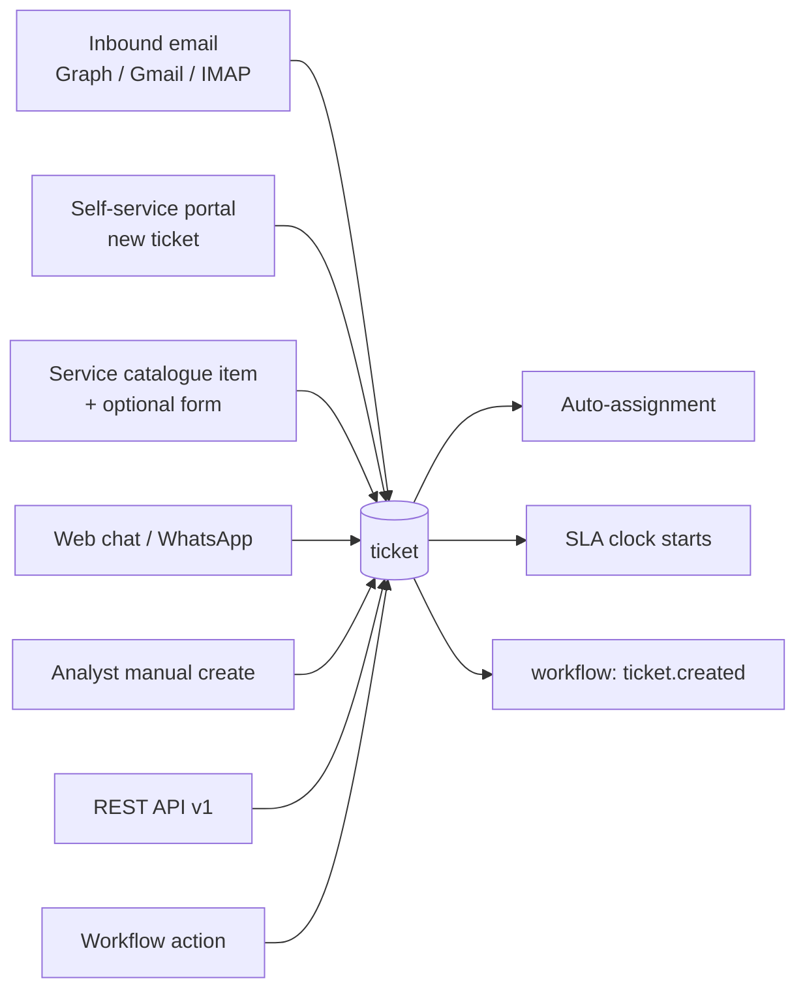
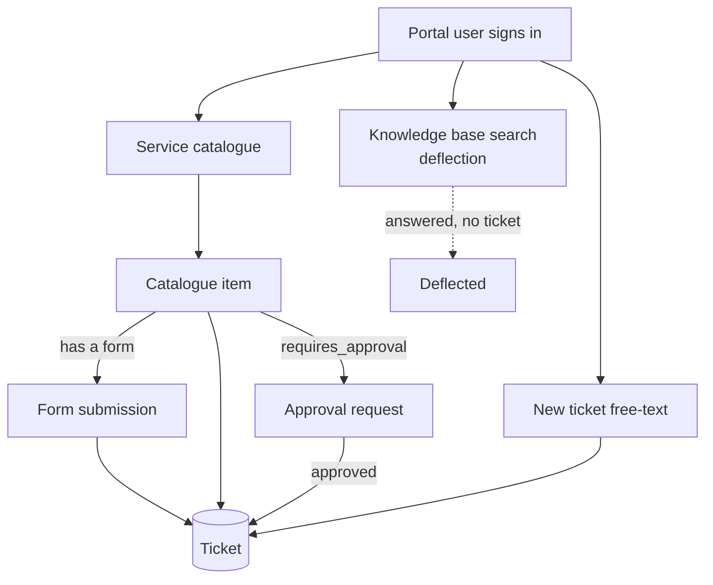

# How freeitsm works

A rundown of the whole platform: what the pieces are, what each one is responsible
for, and — the part that is hard to reconstruct from the code — **how they link
together**.

Read this first if you are new to the codebase, coming back to it after a break, or
about to change something that touches more than one module.

Deep dives that already exist and are not repeated here: [`sla.md`](sla.md) (the SLA
engine's design and decisions), [`cmdb.md`](cmdb.md) (the CMDB's data model and UX
principles), [`roadmap.md`](roadmap.md) (what is built, planned and deferred), and
the cron setup guides ([SLA](sla-cron-setup.md), [workflow](workflow-scheduled-cron-setup.md),
[webhooks](webhook-cron-setup.md)).

---

## 1. The shape of the system

One PHP application, one MySQL database, run in Docker. No framework, no build step
for the back end, no ORM — plain PDO with prepared statements throughout.

The layout is consistent enough that you can guess where anything lives:

```
<module>/                 the module's pages (index.php, includes/header.php, its JS)
api/<module>/             the module's JSON endpoints, one file per action
api/v1/                   the public REST API (versioned, API-key authed)
includes/                 cross-cutting helpers — one concern per file
includes/services/        the service layer: a module's write rules, once
lang/en/<ns>.php          UI strings
database/freeitsm.sql     canonical schema for a fresh install
api/system/db_verify.php  idempotent migrations for an existing install
cron/                     the six scheduled jobs
docs/                     this file and its siblings
```

A typical request: a page under `<module>/` renders the shell (session, i18n,
theme, timezone, module gate, waffle menu), its JavaScript calls `api/<module>/*.php`,
each endpoint re-checks auth and permissions server-side, does its work through a
service or directly, and returns `{success: true, ...}`.

**Nothing trusts the client.** Every endpoint repeats the session check, the module
check and the company scoping, because hiding a button is not a permission.

### The service layer

Where the UI and the REST API both write the same thing, the rules live once in
`includes/services/<module>.php` and both sides are thin adapters over it. Each
adapter distils its caller into an `ActorContext` (`actorId`, `companyScope`,
`source`, `locale`) so the service never sees a session, an API key or a
superglobal. Services throw `ServiceError`; the adapter turns that into an HTTP
status (API) or `{success: false, error}` (UI).

The canonical behaviour is always the API's: an unknown lookup value is a 422, a
bad date a 400, a write to a trashed record a 409.

---

## 2. Two front doors

| | Analysts (staff) | Portal users (end users) |
|---|---|---|
| Session key | `$_SESSION['analyst_id']` | `$_SESSION['ss_user_id']` |
| Table | `analysts` | `users` |
| Where they land | the modules | `self-service/` |
| Sign-in | username + password, TOTP MFA, or OIDC SSO | password or SSO, with self-registration |

They are genuinely separate populations, not one table with a flag. Anything that
takes an identity should be explicit about which one it means — that is why the
session keys are named the way they are.

SAML SSO (roadmap item 10c) is **not** built; OIDC is.

---

## 3. Permissions: three independent layers

These are orthogonal. An analyst can be allowed *into* a module, not allowed to
*configure* it, and only able to see *some companies'* data within it.

**Layer 1 — module access.** `requireModuleAccess('tickets')` on a page,
`requireModuleAccessJson('tickets')` on an endpoint. Effective access is the union
of the analyst's own grant and every team they belong to (`getAnalystAllowedModules`),
combined per the site's `module_permission_mode` (`most` = union, the default;
`least` = intersection). **Absence means everything** here: an analyst with no
explicit restriction can enter every module. That default is deliberate — it is a
usability surface, not a security boundary.

**Layer 2 — capabilities** (`includes/capabilities.php` + `includes/rbac.php`).
Once inside a module, may they administer its *settings*? Around seventy
capabilities, one per settings tab, **deny by default**, with `is_admin` bypassing
the whole layer. Always pass a `Cap::` constant, never a string: a mistyped string
fails closed and silently (and the admin never sees it, because `is_admin`
short-circuits first), whereas a mistyped constant is an immediate fatal on the
first request. That asymmetry is the entire reason the class exists.

The capability catalogue is **derived from the settings manifests**, so it covers
configuration surfaces. Functional, operational modules do not fit that shape, so
newer ones (Overtime, KPI, Customers) gate on module access plus `is_admin` where
they need an admin check, and LMS uses its own `Cap::LMS_MANAGE` learner/manager
split.

**Layer 3 — companies.** See the next section.

---

## 4. Multi-tenancy (companies)

Company-scoped tables carry `tenant_id`. An analyst has an **active company**
(switched in the UI) and a set of accessible companies (`getAccessibleTenantIds`,
or unrestricted).

Two filter helpers produce the WHERE fragment, and you should use one of them
rather than writing the predicate by hand:

- `ticketTenantFilter($conn, $analystId, 't')` — for tickets.
- `activeTenantFilter($conn, $analystId, $alias, $col)` — for every other scoped table.

Both return `['', []]` on a single-company install, so a one-company deployment
pays nothing. **The Default company also owns `NULL`-tenant rows**, which is what
stops an unrouted inbound ticket from vanishing from every view.

Deliberately **not** company-scoped, because they are shared by design: CMDB
objects, contracts, and customers. Do not "fix" those without deciding you want
per-company copies of them.

Phase 10e audited this end to end and closed eleven cross-company leaks; if you add
a list query to a scoped module, that audit is the standard to hold yourself to.

---

## 5. How tickets work

The ticket is the centre of the system. Everything else either feeds it, describes
what it is about, or measures it.

### Ways a ticket is born



Inbound mail is polled per mailbox (`target_mailboxes`); a reply that matches an
existing ticket is attached to it, and anything else becomes a new ticket. Which
**company** a new email ticket belongs to is resolved in order: single-company →
Default; pinned mailbox → that company; then sender domain rules, with freemail
domains excluded from domain matching.

### The write choke point

`TicketsService::updateTicket()` is where status, priority, lookups, assignment,
booleans, schedule and company moves all go through. Putting them in one place is
what makes the side effects reliable, because that one function also:

- stamps `closed_datetime` when the new status is `is_closed`
- keeps `owner_id` in step with assignment
- sends template emails
- auto-triggers CSAT on close (when `csat_mode` is `auto`)
- writes the SLA snapshot
- fires KPI instrumentation (see §12)
- dispatches the workflow events

**The gotcha that has bitten twice:** `api/tickets/assign_ticket.php` has a field
**whitelist**. A new ticket field editable from the reading pane must be added there
or it is silently dropped — no error, the value just never arrives. If a field
"won't save" from the reading pane, look there first.

### What hangs off a ticket

| Thing | Table | Notes |
|---|---|---|
| Status | `ticket_statuses` | `is_closed` and `pauses_sla` are the two flags that carry behaviour |
| Priority | `ticket_priorities` | selects the SLA target row, not the target itself |
| Audit trail | `ticket_audit` | the SLA engine *reads* this to reconstruct time — see §6 |
| Notes | `ticket_notes` | internal updates |
| Time entries | `ticket_time_entries` | feeds effort, cost-per-ticket and utilisation. `source` (`manual`/`auto`) records origin; both count |
| View sessions | `ticket_view_sessions` | how long an analyst had the ticket open and focused — a *proposal*, not billable time |
| CSAT | `ticket_csat_responses` | tokenised survey URL, HMAC-derived, one row per request |
| Watchers | `ticket_watchers` | notification fan-out |
| Ticket links | `ticket_links` | `related` (symmetric), `duplicate`, `parent`; informational only, same-company |
| Approvals | `ticket_approvals` | raised by a catalogue item that `requires_approval` |
| Custom fields | `custom_field_*` | the shared typed-attribute engine, `entity_type = 'ticket'` |
| Affected CIs | `ticket_cmdb_objects` | one may be `is_primary` — this drives SLA policy |
| Customer | `tickets.customer_id` | the account the work is *for* |
| Stream / playbook / QA | `ticket_streams`, `ticket_qa_reviews` | KPI instrumentation |

Auto-assignment (`includes/ticket_autoassign.php`) runs on any path that can leave a
ticket unassigned. Per department: `off`, `round_robin` (stable cursor) or
`least_loaded`, drawing from active analysts on that department's teams. It is
best-effort and never blocks creation.

Filtering is one shared engine (`ticket_filter_build`) used by the ticket list, saved
queues, the ad-hoc bar and the report builder — so a filter written once behaves the
same everywhere.

---

## 6. How SLAs work

The design principle is **compute on read**: no stored counters, no drift. Full
rationale in [`sla.md`](sla.md); the mechanics:

**1. Resolve the policy, most-specific first.**

```
primary affected CI's device policy   (cmdb_object_sla_policies)
        ↓ else
the company's assigned policy         (tenant_sla_policies, once effective_from has passed)
        ↓ else
the global default policy             (sla_policies.is_default = 1)
        ↓ else
no SLA applies
```

This is why linking a CI matters commercially: attaching a device with a tighter
policy re-resolves the target on the very next read, exactly as a priority change
does. Nothing is recalculated in a batch, because nothing was stored.

**2. Read the targets** for the ticket's priority from that policy's
`sla_policy_targets` row — response minutes, resolution minutes, and which business
calendar applies. Targets do **not** come from `ticket_priorities`.

**3. Walk the clock.** `sla_get_state()` replays the ticket's status-change history
from `ticket_audit`, splits its life into *running* and *paused* intervals (a status
with `pauses_sla = 1` pauses it), intersects each running interval with the
calendar's week pattern, holidays and timezone, and sums the business minutes.

**4. Cache only for querying.** Compute-on-read cannot be filtered or grouped in
SQL, so Phase 8a added `ticket_sla_snapshot` — a per-ticket cached verdict
(`ok | approaching | breached | met | na`) written by the breach cron and at close.
The filter engine and reports read the snapshot; **a single ticket view reads live
SLA**. So snapshot freshness is roughly the cron interval (~5 minutes) for open
tickets, and exact for closed ones. `cron/sla_snapshot_rebuild.php` rebuilds it.

**5. Notify.** `cron/sla_breach_check.php` walks every open SLA-enabled ticket,
decides whether a warning or breach should fire per target, resolves the recipients
from `sla_notification_rules`, sends through the ticket's own mailbox, and dedups via
`sla_notifications_sent` so each (ticket, target, trigger) fires at most once. It
also emits the `sla.warning` / `sla.breached` workflow events from the same pass —
which is why those two are not in the scheduled-workflow cron.

If `sla_enforce_from` is empty, SLA enforcement is off and the cron exits early.

---

## 7. How the CMDB links to everything

The CMDB is the "what" behind the work. Objects belong to a **class** (Server,
Database, Application, Service, Person, Team, Network Device, Endpoint in the demo
set), each class defines **typed properties** through the shared custom-field engine
(text, number, date, boolean, dropdown, `object_ref`), and objects relate to each
other in two different ways:

- **hierarchy** — `parent_id`, cycle-checked, delete takes the descendant tree
- **relationships** — typed and directional (`depends on` / `hosts` / `managed by` …)

### Blast radius

`api/cmdb/get_object_impact.php` answers "what breaks if this goes away" from three
buckets, and this one function is reused everywhere impact is shown:

1. **descendants** — everything below it in the hierarchy
2. **referenced_by_property** — objects whose `object_ref` property points at it
   (the database whose *Host Server* is this server)
3. **referenced_by_relationship** — the other side of any *incoming* relationship

### Who links to CIs, and what the link changes

| Link | Table | What it actually does |
|---|---|---|
| Ticket → CI | `ticket_cmdb_objects` (`is_primary`) | the primary CI can **override the SLA policy** (§6) |
| Change → CI | `change_cmdb_objects` | union of blast radii → a **suggested** impact score 1–5 |
| Customer → CI | `customer_cmdb_objects` | which CIs belong to a customer account |
| CI → SLA policy | `cmdb_object_sla_policies` | device-level policy, the most specific tier |
| Network mapper | `network_diagram_*` | visual diagrams over the CMDB graph |

Note the change case carefully: the impact **suggests**, the analyst still owns the
final `likelihood × impact`. Risk is never auto-written.

**Assets are not CIs.** `assets` is the physical inventory (serial numbers,
warranty, purchase cost, discovery data from the agent, Intune and vCenter).
`cmdb_objects` is the service model. They coexist on purpose; do not merge them.

---

## 8. Change, problem and the ITIL loop

**Changes** carry a schedule (`work_start` / `work_end`, plus outage window), a CAB
flow (`cab_required`, approval type, approver, `change_cab_members`), a risk score
from `risk_likelihood × risk_impact_score`, a field layout an admin can rearrange, a
test and rollback plan, and a post-implementation review. They appear on the change
calendar.

**Freeze windows** (`change_freeze_windows` + `change_freeze_scopes`) are blackout
periods. They produce a **soft warning** on schedule and approve, not a hard block,
and emergency changes are exempt — because a freeze that cannot be overridden gets
worked around outside the system.

**Problems** are the KEDB: root cause, workaround, `is_known_error`, an append-only
notes journal, and links to the incidents they explain (`problem_tickets`) and the
change that fixes them (`change_relations` with `related_type = 'problem'`). Both
link types enforce **same-company** — a problem cannot be linked to another
company's incident.

The loop in practice: incidents accumulate → a problem is raised and linked to them
→ investigation finds a root cause → a change is raised to fix it → the change
records affected CIs → the CMDB says what else that touches → the fix lands and the
problem closes as a known error with a workaround for anyone who hits it again.

---

## 9. Assets, software and contracts

**Assets** — inventory with an agent sync plus vCenter and Intune feeds, types,
statuses, locations, user assignment and checkout, warranty, and (Phase 9e)
end-of-life and disposal fields. Warranty and EOL both drive reminders.

**Software** — inventory of discovered applications and the licences that entitle
them. The compliance view (`software/compliance/`) does the true-up: installed
versus entitled, over- and under-deployment, plus renewal reminders.

**Contracts** — suppliers and their contacts, contract terms in configurable tabs,
payment schedules, an AI-assisted RFP builder, and renewal reminders. Phase 9d added
`contract_assets`, so a contract states which assets it covers and an asset can be
traced back to the contract covering it.

All four reminder kinds — contract expiry, asset warranty, licence renewal, asset
EOL, and now certification expiry — fire from the same place at the same windows
(90 / 30 / 7 / 1 days) through the same fire-once ledger. See §11.

---

## 10. The portal, catalogue, forms and knowledge

The end-user path:



A **catalogue item** (`service_catalog_items`) carries the defaults for what it
creates — category, department, priority — optionally attaches a **form**, and
optionally gates on an **approval** by a named analyst. Approvals land in
`ticket_approvals`.

**Forms** are versioned; a submission stores one row per answered field. A
successful submission dispatches the `form.submitted` workflow event with a
label-keyed answers map, which is the "new starter form → create these tickets"
automation. Its errors are swallowed, so a workflow can never break a submission.

**Knowledge** articles are versioned with a draft → review → approve flow, carry
"was this helpful" ratings and review dates, and feed both portal deflection and the
AI web-chat.

The portal is branded per company, and announcements are per company too.

---

## 11. Automation: the workflow engine and the crons

### The engine

`WorkflowEngine::dispatch('ticket.created', ['ticket' => $row])` — modules call
*into* the engine when something happens. The engine finds active workflows for that
event, evaluates conditions, runs actions in order, and writes a `workflow_executions`
row every time so a user can see what happened.

- **Triggers** are flat event names, catalogued in `availableTriggers()`. Every CRUD
  entity gets `created` / `updated` / `deleted` automatically.
- **Conditions** are `{field, op, value}`, read from the payload by dot-notation
  (`ticket.priority`), ANDed. No conditions = always fires.
- **Actions** are `{type, args}`, run in order, handlers on the engine class.
- **Execution is synchronous** in v1, within the host request. Keep actions fast and
  idempotent.
- **Failures never propagate** — per-step exceptions are caught, logged into the
  execution row, and the host request carries on. A buggy workflow cannot take down
  the module that dispatched it.
- **Loop protection** is request-scoped, because a workflow's action can mutate data
  that dispatches the event that re-runs it.

Outbound **webhooks** have their own delivery log with replay.

### Time-based triggers are different

Most triggers hang off a write path — someone saved something, so there is a moment
to fire from. Four do not: *"this contract expires in 30 days"* is not an event,
nothing happened, **time passed**. Those need a cron to go looking, plus a
fire-once ledger (`workflow_scheduled_emissions`) so a still-true condition does not
re-fire every few minutes.

### The six crons

| Cron | Cadence | What breaks without it |
|---|---|---|
| `sla_breach_check.php` | ~5 min | no SLA warnings or breach emails, no `sla.*` workflows, stale SLA snapshot |
| `workflow_scheduled.php` | hourly | no contract / warranty / licence / EOL / certification reminders |
| `scheduled_reports.php` | hourly | scheduled reports never send |
| `sla_snapshot_rebuild.php` | nightly | snapshot drifts from reality over time |
| `kpi_snapshot.php` | daily | KPI scorecards stay empty of computed metrics |
| `webhook_deliveries.php` | as configured | webhook retries never run |

They all share one security harness: the `sla_cron_token` secret, per-IP lockout
after repeated auth failures, a minimum interval between runs, and a row in
`sla_cron_runs` for every run. Each sibling tags its runs with a marker (e.g.
`[kpi-snapshot]`) so the crons never rate-limit each other.

---

## 12. Reporting, dashboards and KPIs

**Ticket report builder** — group-by plus the shared filter engine, CSV out. The
query logic lives in `includes/ticket_report.php` so the interactive builder and the
scheduled runner cannot disagree. **Scheduled reports** (`scheduled_report` +
`cron/scheduled_reports.php`) run a saved report on a cadence and email it.

**Executive dashboard** (`reporting/executive/`) is a curated cross-module KPI view.
**Watchtower** is the "what needs attention right now" board across modules.
Per-module dashboards (tickets, assets, software) have their own widget systems.

**Audit and logs** — `system/audit/` is a read-only aggregator over every module's
audit trail with CSV export; `reporting/logs/` is the application log.

### The KPI module

Built to pull the NOC KPI framework out of freeitsm's own data rather than a
parallel spreadsheet.

- **K0 — the catalogue.** `kpi_definitions` (~69 seeded metrics across five
  scorecards: L1, L2, L3, L3-BAU, Combined) and `kpi_measurements`, one value per
  KPI per month. The scorecard page shows target, value, RAG, a six-month sparkline
  and a source badge, with manual entry and CSV import/export.
- **K1 — instrumentation.** A ticket's **tier is its owner's tier**
  (`analysts.tier`). `TicketsService::updateTicket` hooks
  `includes/kpi_instrument.php` to capture what can only be captured at the moment
  it happens: first acknowledgement (the MTTA anchor, stamped once), escalations
  (an owner change to a *higher* tier), and hold intervals (entering and leaving a
  `pauses_sla` status). NOC/SOC stream, playbook eligibility and QA reviews are
  captured in the reading pane. All of it is best-effort and never breaks an update.
- **K2 — the engine.** `includes/kpi_engine.php` + `cron/kpi_snapshot.php` compute
  around thirty metrics per tier per month — SLA attainment, MTTR, MTTA, throughput,
  reopen rate, bounce, escalation rate and time, on-hold time, QA pass rates.
  Anything it cannot compute is skipped, so hand-entered and imported values survive
  every run.
- **K3 — cost and capacity.** `analysts.loaded_rate` and
  `contracted_weekly_hours` turn time entries into cost per ticket, utilisation,
  tickets per FTE, out-of-hours rate and CSAT.

Metrics that need external SIEM or estate feeds stay manual or CSV-imported by
design — there is no integration.

---

## 13. The people modules

**Overtime** — submit → line-manager approval → payroll report and CSV. Routing is
by `analysts.manager_id`: your approvals queue is the pending claims of the analysts
who report to you.

**LMS** — SCORM packages and natively-authored courses, learning groups,
assignments with deadlines, and progress tracking. Access splits two ways: the
`lms` module lets you *take* assigned courses; `Cap::LMS_MANAGE` lets you author,
assign and see everyone's progress.

**Training and certifications** — a certification catalogue with validity periods,
per-analyst certifications with award and expiry dates (amber inside 90 days, red
once expired), and a log of training completed outside the LMS. Visible to the
analyst, their line manager, and LMS managers. Expiry fires
`certification.expiring` through the scheduled-workflow cron.

**The development journal** — the one deliberately private surface. An analyst's
journal is readable by them and their **line manager only**: not LMS managers, not
administrators, and it is excluded from data export. Both parties can write; each
entry records its author and only the author can edit it. The single gate is
`lmsJournalCanAccess()`. If that rule is ever meant to change, change it there,
on purpose — do not let it drift in through capability inheritance.

---

## 14. Data in and out

Four surfaces, deliberately different because reading and writing carry different
risks:

| Surface | Where | Gate | Shape |
|---|---|---|---|
| **Data export** | Reporting → Export | module access per dataset | ~27 datasets, columns read from the **live schema**, secrets filtered by name, tenant-filtered, CSV or JSON, streamed |
| **Mass import** | System → Mass import | admin **and** the module | 18 datasets, every column **explicitly declared**, foreign keys resolved by **name**, preview → commit in one transaction |
| **Backup / narrow CSV** | System → Backup & data | admin | streaming `mysqldump`; the original assets/users round-trip import |
| **Demo data** | System → Backup & data | admin | tiered JSON in `database/demo-data/`, plus the CSV bundle in `database/demo-csv/` |

The export is generous because it only reads; the importer is strict because it
writes. An unresolvable name on import is a reported row error, never a silent
`NULL` — that is the difference between a spreadsheet you can trust and one that
half-lands.

Not importable on purpose: **analysts** (they carry credentials and module access),
secrets and wiring (API keys, workflows, SLA policies, RBAC), and the development
journal.

⚠️ The **JSON demo-data importer deletes** every table it inserts into before
loading (keeping only rows matched by a `_skip_insert` rule — which is how the
`admin` account survives). It is for test installs. The CSV bundle in
`database/demo-csv/` is additive and safe by comparison; its README gives the load
order.

---

## 15. Adding to the system

**A migration goes in two places, always:**

1. `database/freeitsm.sql` — the canonical fresh install, inside the
   `SET FOREIGN_KEY_CHECKS=0 … =1` block.
2. `api/system/db_verify.php` — the idempotent `$schema` map plus FK/index blocks
   using `$tableExists` / `$colExists` / `$idxExists` / `$fkExists`, each
   try/catch-swallowed. Seeds go here too.

"Column in the SQL, FK added by db_verify" is an accepted split. Database Verify is
the validation step — it reports exactly which tables, columns, FKs and indexes it
created.

**A new module registers in five places**, and ships *with* its first page so there
is never a dead nav link:

- `includes/functions.php` → `getModuleRegistry()`
- `includes/waffle-menu.php`
- `includes/module-colors.php`
- `lang/en/common.php` → the modules block
- its own `<module>/includes/header.php` shell

**A new cron** reuses the SLA breach harness: shared token, per-IP lockout, minimum
interval, `sla_cron_runs` logging, and its own `[marker]` so siblings do not
rate-limit each other.

**New UI strings** are English-only (`t()` falls back to `en`); add keys to
`lang/en/<ns>.php`.

---

## 16. Deploy and verify

There is no local lint or test suite. The validation loop is:

```bash
git push origin main
```

then on the server:

```bash
sudo -i
cd /root/freeitsm
cp database/freeitsm.sql database/freeitsm.sql.bak.$(date +%F-%H%M)
git pull
docker compose up --build -d
```

then **Database Verify** (`api/system/db_verify.php` as an admin) to confirm the
schema, then the manual test steps. The test plan
(`freeitsm-test-plan.xlsx`, ~187 cases across 25 suites) is the script for that last
part; load `database/demo-csv/` first so there is data to test against.

---

## 17. The gotchas worth knowing before you touch anything

1. **`api/tickets/assign_ticket.php` has a field whitelist.** A new ticket field
   editable from the reading pane must be added there or it is silently dropped.
2. **SLA is compute-on-read; the snapshot is only for querying.** Filter and report
   from the snapshot, show a single ticket from live state. Never add a stored
   counter.
3. **A ticket's tier is its owner's tier.** An analyst with no tier keeps their
   tickets out of every tier scorecard. That is expected, not a bug.
4. **Tracked time is only ever a proposal.** The view timer accumulates focused
   seconds into `ticket_view_sessions`; nothing becomes a time entry until the
   analyst accepts it, and what lands is stamped `source = 'auto'`. Once accepted
   it counts like any other entry — including in cost per ticket, utilisation,
   tickets per FTE and the out-of-hours rate. So the effort KPIs get more
   complete as analysts accept tracked time, which is the intent; `source` is
   there to explain a rise, not to exclude it.
5. **KPI instrumentation is best-effort by contract.** It must never break a ticket
   update; a `[kpi]` line in the error log means the capture failed and the update
   still committed.
6. **The Default company owns `NULL`-tenant rows.** Any new scoped query must keep
   that, or unrouted tickets disappear.
7. **CMDB, contracts and customers are shared across companies on purpose.**
8. **Always pass a `Cap::` constant.** A mistyped capability string is a privilege
   escalation that only non-admins ever see.
9. **Change risk is never auto-written.** The CMDB suggests; the analyst decides.
10. **Freeze windows warn, they do not block** — and emergency changes are exempt.
11. **The journal's visibility rule lives in one function.** Keep it that way.
12. **Workflow actions run synchronously in the host request.** Slow action, slow
    save.
13. **The JSON demo importer truncates tables.** Test installs only.
